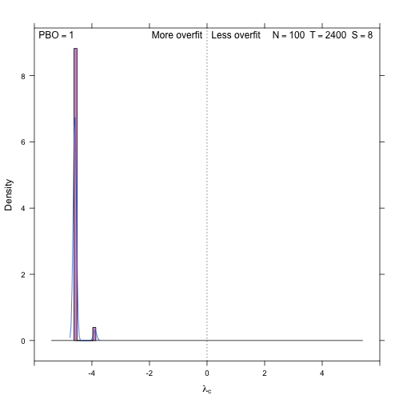
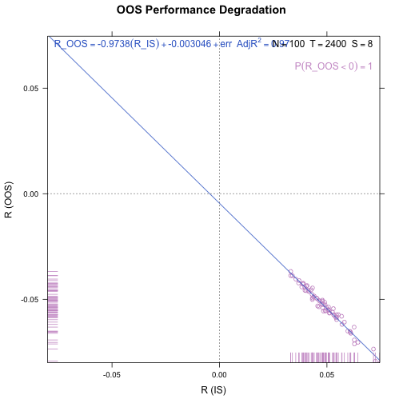
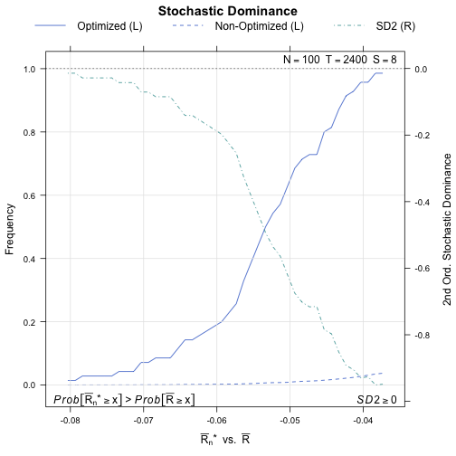
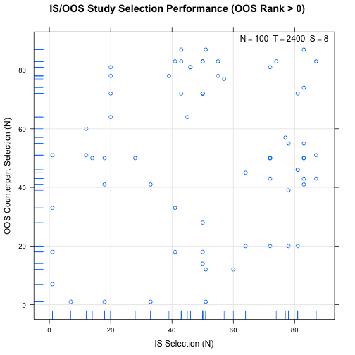
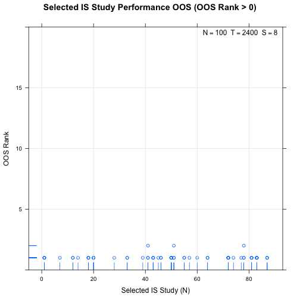
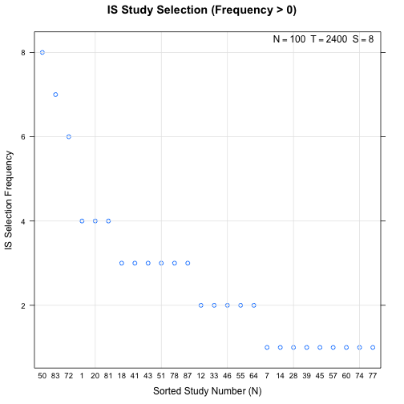

%\VignetteEngine{knitr::knitr}

Probability of Backtest Overfitting
===================================

The package __pbo__ provides convenient functions for analyzing a matrix of backtest trials to compute the probability of backtest overfitting, the performance degradation, and the stochastic dominance of the fitted models.  The approach follows that described by Bailey et al. in their paper "The Probability of Backtest Overfitting" (reference provided below).

First, we assemble the trials into an NxT matrix where each column represents a trial and each trial has the same length T.  


```r
set.seed(765)
n <- 100
t <- 2400
m <- data.frame(matrix(rnorm(n * t), nrow = t, ncol = n, dimnames = list(1:t, 
    1:n)), check.names = FALSE)

sr_base <- 0
mu_base <- sr_base/(252)
sigma_base <- 1/(252)^0.5

for (i in 1:n) {
    m[, i] = m[, i] * sigma_base/sd(m[, i])  # re-scale
    m[, i] = m[, i] + mu_base - mean(m[, i])  # re-center
}
```


We can use any performance evaluation function that can work with the reassembled sub-matrices during the cross validation iterations.  Following the original paper we can use the Sharpe ratio as


```r
sharpe <- function(x, rf = 0.03/252) {
    sr <- apply(x, 2, function(col) {
        er = col - rf
        return(mean(er)/sd(er))
    })
    return(sr)
}
```


Now that we have the trials matrix we can pass it to the `pbo` function for analysis. The analysis returns an object of class `pbo` that contains a list of the interesting results. For the `Sharpe` ratio the interesting performance threshold is 0 (the default of 0) so we pass `threshold=0` through the `pbo` call argument list. 


```r
require(pbo)
```

```
## Loading required package: pbo
## Loading required package: lattice
## Loading required package: latticeExtra
## Loading required package: RColorBrewer
## Loading required package: grid
## Loading required package: testthat
## Loading required package: doParallel
## Loading required package: foreach
## Loading required package: iterators
## Loading required package: parallel
```

```r
my_pbo <- pbo(m, s = 8, f = sharpe, threshold = 0)
```


The `my_pbo` object is a list we can summarize with the `summary` function.


```r
summary(my_pbo)
```

```
## Performance function sharpe with threshold 0
```

```
##      p_bo     slope      ar^2    p_loss 
##  1.000000 -0.003046  0.970000  1.000000
```


We see that the backtest overfitting probably is 1 as expected because all of the trials have the same performance.  We can view the results with the package's preconfigured `lattice` plots.  The `xyplot` function has several variations for the `plotType` parameter value. See the `?xyplot.pbo` help page for the details. 


```r
require(lattice)
require(latticeExtra)
require(grid)

histogram(my_pbo, type = "density")
```

 

```r
xyplot(my_pbo, plotType = "degradation")
```

 

```r
xyplot(my_pbo, plotType = "dominance", increment = 0.001)
```

 

```r
xyplot(my_pbo, plotType = "pairs")
```

 

```r
xyplot(my_pbo, plotType = "ranks", ylim = c(0, 20))
```

 

```r
dotplot(my_pbo)
```

 


The package also supports parallel execution on multicore hardware, providing a potentially significant reduction in `pbo` analysis time.  The `pbo` package uses the `foreach` package to manage parallel workers, so we can use any package that supports parallelism using `foreach`.  

For example, using the `doParallel` package we can establish a multicore cluster and enable multiple workers by passing the above `m` and `s` values along with the argument `allow_parallel=TRUE` to `pbo`as follows:


```r
require(doParallel)

cluster <- makeCluster(detectCores())
registerDoParallel(cluster)
p_pbo <- pbo(m, s = 4, f = sharpe, allow_parallel = TRUE)
stopCluster(cluster)

summary(p_pbo)
```

```
## Performance function sharpe with threshold 0
```

```
##      p_bo     slope      ar^2    p_loss 
##  1.000000 -0.005909  0.880000  1.000000
```


Reference
---------
Bailey, David H. and Borwein, Jonathan M. and Lopez de Prado, Marcos and Zhu, Qiji Jim, "The Probability of Back-Test Overfitting" (September 1, 2013). Available at [SSRN](http://ssrn.com/abstract=2326253 or http://dx.doi.org/10.2139/ssrn.2326253).
